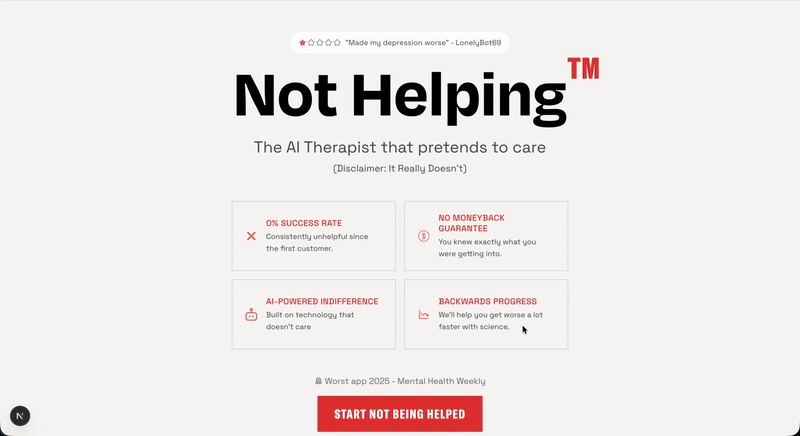

# Not Helper™ — The AI Therapist That Pretends To Care  
_(Disclaimer: It Doesn’t)_

_Not Helping™_ is a satirical AI therapy experience featuring multiple therapist personalities, voice synthesis, contextual responses, and a user-driven onboarding journey that evaluates your “damage level” before connecting you to a deeply unqualified AI professional.

This is not a mental health app. It’s a **product experiment in applied AI, persona design, and interactive storytelling.**

  
   
  <em>Demo — persona selection → session</em>

---

## 🎥 Demo Video

📺 **Live Demo:** [YouTube Link Here]  
*(Recommended with sound — voice synthesis is part of the experience)*

---

## 🧩 Why It Exists

Most AI “therapy” tools try to:

✔ cheer you on  
✔ remove discomfort  
✔ avoid confrontation  

NotHelper does the opposite:

✘ discomfort is the point  
✘ confrontation is the mechanic  
✘ humor is the coping strategy  

The goal:  
> **Simulate therapy… badly.**

---

## 🙋 User Experience Flow

A full session typically looks like:

1. **Damage Assessment** (what's wrong with you)
2. **Therapist Selection** (which persona ruins your day)
3. **Reality Check** (contextual humor based on time & behavior)
4. **Voice Session** (real-time back & forth over WebSockets)
5. **Sarcastic Summary** (negative progress report)

Users describe it as  
> “weirdly honest and mildly therapeutic against my will.”

---

## 🎭 Therapist Personas

Each therapist has a unique voice, tone, cadence, and worldview:

| Therapist | Vibe | Specialization |
|---|---|---|
| **Dr. Void** | Existential retail employee | Emotional numbness |
| **Dr. Burnout** | Overworked clinician | Exhaustion & regret |
| **Dr. Dread** | Catastrophizer | Negative forecasting |
| **Dr. Karen** | Judgmental & confident | Shame-based motivation |

No two sessions sound the same.

---

## 🔊 Voice & Interaction

Sessions blend:

- **LLM-generated dialogue**
- **Voice synthesis (real-time)**
- **Progressive text reveal**
- **Typing indicators**
- **Playback control**
- **Message acknowledgement**
- **Session lifecycle events**

Voice is not a gimmick here —  
It shapes persona, timing, and comedic delivery.

---

## 🕹 Onboarding Journey

The UX intentionally borrows from:

✔ mobile apps  
✔ game UI  
✔ onboarding funnels  
✔ personality quizzes  
✔ narrative games

The result is a **guided comedic arc**, not an open chat box.

---

## 🧩 High Level Architecture + Design

- **Frontend:** React + Next.js + Tailwind (mostly client mode)
- **LLM layer:** Applied AI + persona pipelines
- **Socket layer:** Real-time events for chat, typing, voice playback
- **Voice:** Synthesis + timing + text rendering
- **State:** Client session state machine (multi-step journey)

---

## High-Level Data Flow

A typical user message moves through the system as follows:

1. **Web Client (Next.js)**
   Captures user input and streams via WebSockets.

2. **Session Gateway (NestJS)**
   Manages session state and routes requests.

3. **Persona Engine**
   Applies persona constraints, memory, probing behaviors, and refusal rules.

4. **LLM Layer (Gemini 1.5 Flash)**
   Generates the actual therapist response content.

5. **Voice Synthesis (ElevenLabs)**
   Converts the textual response into playable audio.

6. **Web Client**
   Receives audio + transcript over WebSockets and renders the session UI.

---

## 🚫 What This Project Is *Not*

This is not:

✖ therapy  
✖ a self-help tool  
✖ a wellness product  
✖ clinically validated  
✖ emotionally supportive  
✖ useful in any measurable sense

It is **purely entertainment and product experimentation**, inspired by the creative misuse of AI.

---

## 🧱 Product Goals

This project was built to explore:

- **Product Engineering** → not just raw AI calls  
- **Persona Design** → psychology + tone + timing  
- **Voice UX** → how audio influences perception  
- **Contextual Humor** → day/time/user inputs  
- **Orchestrated Journeys** → instead of open-ended chat  
- **Real-Time Systems** → sockets, streaming, session state  

---

## 🎯 Audience Fit

This project resonates with:

- AI product designers
- Applied LLM engineers
- Creative technologists
- UX researchers
- Founders & early-stage builders
- People with questionable life choices

---

## 📝 Legal & Ethical Notes

- Not intended for real mental health use
- Satirical & comedic by design
- Avoids sensitive harm scenarios
- Disclaims therapeutic claims
- Encourages actual therapy for actual issues

---

## © Attribution

_Not Helping™_ — 2025–2026  
A creative product experiment by **[Dawood Hamayun]**

